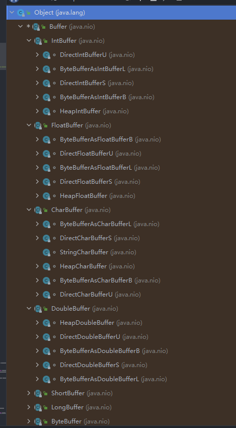

# I/O模型介绍

I/O模型就是用什么样的通道进行数据的发送与接收，很大程度上决定了程序通信的性能

Java共支持3种网络IO模型：BIO、NIO、AIO

**BIO**：同步阻塞模型，服务器实现模式为一个连接一个线程，即客户端有连接请求时服务器就需要启动一个线程进行处理，**如果这个连接不做任何事情（没有数据需要读取时）会进行阻塞造成不必要的线程开销**

**NIO**：同步非阻塞模型，服务器实现模式为一个线程处理多个请求，即客户端发送的连接请求都会注册到多路复用器上，多路复用器轮询到连接有IO请求就进行处理

**AIO**：异步非阻塞模型，AIO引入了异步通道的概念，采用了Proactor模式，简化了程序编写，有效的请求才启动线程。它的特点是先由操作系统完成后才通知服务器程序启动线程处理，一般适用于连接数较多且连接时间较长的应用

## 阻塞与非阻塞的区别

个人理解，阻塞与非阻塞本质上的区别就是一个线程（协程）能处理多少个请求（这里指的是无障碍正常处理）。

如果一个线程只能处理一个请求，那这就是阻塞模型。如果能处理多个请求，那就是非阻塞模型。

## 同步与异步的区别

NIO虽然是非阻塞的，但仍然是个同步模型，那么怎么去理解这个同步呢？

实际上，假设我们没有用任何的Selector，在一个循环内获取连接accpet，在非阻塞的情况下，当没有获取到accpet时就不会阻塞，而是在循环内再次去获取。

**而当我们获取到了accept，在我们拿到这个数据的过程，又或者是复制数据的过程，我们必须得等到数据返回了以后才能进行下一步**，这个就是NIO是同步的原因

那么异步也很显然了，就是在我们拿这个数据的过程中**不进行等待**，而是在这个数据返回后通过一个**回调函数（线程）**来获取，这个就叫做异步。

# NIO 介绍

1. Java NIO全称Java Non-Blocking IO，是指jdk提供的新api。从jdk1.4开始，java提供了一系列改进的IO的新特性，被统称为NIO(New IO)，是**同步非阻塞**的
2. NIO相关的类都被放在java.nio包下，并且对原java.io包中的很多类都进行了改写
3. NIO有三大核心部分：**Channel（通道），Buffer（缓冲区），Selector（选择器）**
4. NIO是**面向缓存区**，或者**面向块**编程的。数据读取到一个它稍后处理的缓冲区，需要时可在缓冲区中前后移动，这就增加了处理过程中的灵活性，使用它可以提供非阻塞性的高伸缩性网络
5. NIO的非阻塞模式是一个线程从某通道发送或读取数据时，仅得到当前可用的数据，如果没有可用的数据就什么都不会获取，**而不是保持线程阻塞**。所以直到数据可用之前，线程可以继续做其他的事情。
6. HTTP2.0使用了多路复用的技术，做到同一个连接并发处理多个请求，而且并发请求的数量比HTTP1.1大了好几个数量级

## 1. 缓冲区（Buffer）

缓冲区本质上是一个可以读写数据的内存块，可以理解成一个**容器对象（含数组）**，该容器提供了一组方法，可以更轻松的使用内存块。

缓冲区对象内置了一些机制，能够追踪和记录缓冲区的状态变化情况。Channel提供从文件、网络读取数据的渠道，但是读取或写入的数据都必须经由Buffer

### Buffer类极其子类

在NIO中，Buffer是一个顶层父类，它是一个抽象类，层级图如下

* ByteBuffer，存储字节数据到缓冲区
* ShortBuffer，存储字符串数据到缓冲区
* CharBuffer，存储字符数据到缓冲区
* ...

Buffer类定义了所有的缓冲区都具有的四个属性来提供关于其所包含的数据元素的信息，例如：缓冲区的容量，终点，当前位置，标记等

## 2. 通道（Channel）

NIO的通道类似于流，有以下区别

* 通道可以进行读写，而流只能读或写
* 通道可以实现异步读写数据
* 通道可以从缓冲读数据，也可以写数据到缓冲

Channel是一个接口，常用的实现类有：`FileChannel`, `DatagramChannel`, `ServerSocketChannel`和`SocketChannel`。其中`FIleChannel`用于文件的数据读写，DatagramChannel用于UDP的数据读写，ServerSocketChannel和SocketChannel用于TCP的数据读写

### FileChannel

> 注意：FileChannel只能工作在阻塞模式中

`FileChannel`不能直接打开，必须用过`FileInputStream`、`FileOutputStream`、`RandomAccessFile`来获取`FileChannel`，他们都有`getChannel`方法

* 通过`FileInputStream`获取的Channel只能读
* 通过`FileOutputStream`获取的Channel只能写
* 通过`RandomAccessFile`获取的channel根据构造`RandomAccessFile`时的读写模式决定是否可读可写

## 3. 选择器（Selector）

Selector负责监听事件，然后分发给Channel

Channel注册到Selector时，需要保证是非阻塞的，即调用方法`configureBlocking(false)`

### accept处理

从accpet中获得的Channel注册进Selector之后，即可读取数据

### read处理

read需要注意错误处理，有如下两种情况

* 客户端异常关闭，则会抛出异常，如果没有处理则会直接中断线程，所以要捕获异常然后把key给`cancel`掉
* 客户端正常关闭，会返回-1，如果没有处理，因为key没有被删掉所以会一直循环下去，所以需要判断返回值

## 4. Thread, Selector, Channel, Buffer之间的关系

1. 一个Thread对应一个Selector
2. 一个Selector对应多个Channel
3. 一个Channel对应一个Buffer
4. 程序切换到哪个Channel是由事件(Event)决定的，Selector会根据不同的事件，在各个通道上切换
5. Buffer就是一个内存块，低层维护了一个数组
6. 数据的读写是通过Buffer，与BIO通过流不同，NIO的Buffer可以读也可以写，用Flip方法切换
7. Channel是双向的，可以返回低层操作系统的情况

## 5. 多线程优化

> 现在都是多核cpu，设计时要充分考虑cpu多核的利用

NIO如果只用一个选择器，就不能充分的利用多核cpu，该如何改进？

分两组选择器

* 单线程配一个选择器，专门处理accept事件
* 创建cpu核心数的线程，每个线程分配一个选择器，轮流处理read事件

需要注意的细节问题

* Channel注册到Selector时，应该让read的线程来注册，而不是让accept的线程来注册
* 线程之间通信可以用一个队列来进行
* Selector的select方法会阻塞当前线程，如果这时候注册进Selector将无法实时反映，可以用wakeup方法来唤醒一次select
* 多线程的线程数设置为当前服务器的cpu核心数即可

# Netty 介绍

Netty是由JBOSS提供的一个java开源框架，现为Github上的独立项目

Netty是一个**异步的，基于事件驱动**的网络应用框架，用以快速开发高性能、高可靠性的网络IO程序

Netty主要针对TCP协议下，面向Client端的高并发应用，或者Peer-to-Peer场景下的大量数据持续传输应用

Netty本质是一个NIO框架，适用于服务器通讯相关的多种应用场景

# Netty 优势

* Netty VS NIO，工作量大，bug多
  * 需要自己构建协议
  * 需要自己解决TCP传输问题，例如黏包，半包
  * epoll空轮询导致cpu占用
  * 对API进行增强，使其更易用
* Netty VS 其他网络应用框架
  * Mina由apache维护，将来的3.x版本可能会有较大的重构，破坏API向下兼容性，Netty的开发迭代更迅速，API更简洁，文档更优秀

# Netty 组件

## 1. 大致解析

* `ServerBootStrap`类为Netty的启动器，负责组装Netty的组件，启动服务器等
* `Channel`可以理解为数据的通道
* `msg`为流动的数据，最开始输入的是`ByteBuf`，经过`pipeline（流水线）`的加工后会变成其他对象（例如字符串），最后输出又变成`ByeBuf`
* `handler`为数据的处理工序
  * 工序有多道，合在一起就是一个`pipeline`，`pipeline`负责发布事件传播给每个`handler`，`handler`对自己可以负责的事件进行处理（重写相应事件的方法）
  * `handler`又分为`Inbound`和`Outbound`两类
* `eventLoop`为处理数据的`Worker`
  * `Worker`可以管理多个`Channel`的IO操作，并且一旦`Worker`绑定了某个`Channel`就无法解除
  * `Worker`既可以执行IO操作，也可以进行任务处理，每个工人都有任务队列，可以堆放多个待处理任务，任务分为普通任务和定时任务（类似线程池的Worker？）
  * `Worker`按照`pipeline`顺序，依次按照`handler`的规划处理数据，可以理解为每道工序指定不同的`Worker`

## 2. EventLoop

`EventLoop`本质是一个单线程执行器（同时维护一个`Selector`），里面有run方法处理`Channel`上的IO事件

它的继承关系比较复杂，有两条线路

* 一条线继承于`juc.ScheduledExecutorService`，因此`EventLoop`实际上也是个线程池
* 另一条继承于netty自己的`OrderedEventExecutor`
  * 提供了`inEventLoop(Thread)`判断一个线程是否属于此`EventLoop`
  * 提供了parent方法也查找自己属于哪个`EventLoopGroup`

`EventLoopGroup`是一组`EventLoop`，`Channel`一般会调用`EventLoopGroup`的register方法来绑定其中一个`EventLoop`，后续这个`Channel`上的IO事件都由此`EventLoop`来处理

* `EventLoopGroup`继承于netty的`EventExecutorGroup`
  * 实现了Iterable接口，提供遍历`EventLoop`的能力
  * 另有next方法获取集合中下一个`EventLoop`

## 3. Channel

`Channel`的主要作用

* `close()`可以用来关闭`Channel`
* `closeFuture()` 可以用来处理`Channel`的关闭
  * `sync()`方法的作用是同步等待`Channel`的关闭
  * `addListener`方法是异步等待`Channel`关闭
* `pipeline()`方法添加`handler`
* `write()`方法写入数据但不刷出，需要配合`flush()`
* `writeAndFlush()`方法将数据写入并刷出

`ChannelFuture`，主要用于获取和关闭`Channel`，有同步和异步两种

* 获取，需要注意`Bootstrap.connect(SocketAddress)`方法是异步的，所以获取时也要注意
  * 同步获取：调用`sync()`阻塞，等待连接完毕
  * 异步获取：调用`addListener(CallBack)`把当前future当做回调对象放入参数的接口中
* 关闭
  * 同步关闭：`sync()`
  * 异步关闭：`addListener`

## 4. Future & Promise

在异步处理时，经常用到这两个接口

Netty的`Future`和Java的`Future`同名，但是是两个接口。Netty的`Future`继承自jdk的`Future`，而`Promise`又对Netty的`Future`进行了扩展

* jdk的`Future`只能**同步等待**任务结束才能得到结果
* Netty的`Future`可以同步等待任务结束得到结果，也可以异步得到结果，当然都得等到任务结束
* Netty的`Promise`不仅有Netty的`Future`的功能，而且脱离了任务独立存在，只作为线程间传递结果的容器

## 5. Handler & Pipeline

`ChannelHandler`用来处理`Channel`上的各种事件，分为入站和出站两种。所有`ChannelHandler`被连成一串，就是`Pipeline`

* 入站处理器通常为`ChannelInboundHandlerAdapter`的子类，主要用来读取客户端数据，写回结果
* 出站处理器通常为`ChannelOutboundHandlerAdapter`的子类，主要对写回的结果加工

`Channel`就像一个加工车间，`Pipeline`为流水线，`ChannelHandler`就是流水线上的工序，而`ByteBuf`是原材料，经过了很多入站工序和出站工序的加工最终变成产品